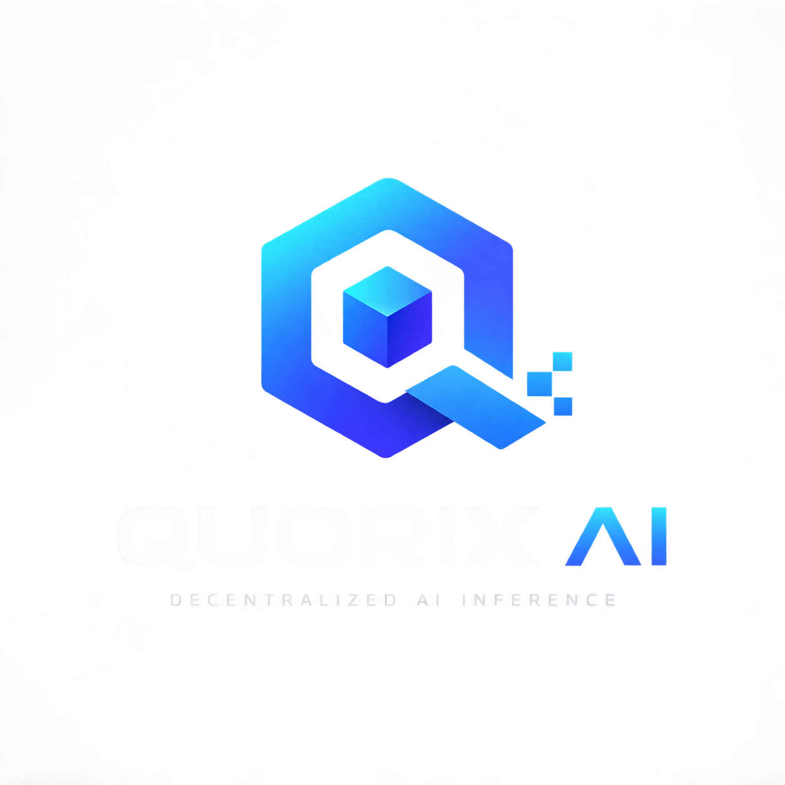

<p align="center">
  
</p>

<h1 align="center">Quorix AI — From Qwen</h1>

<p align="center">
  A community-owned, serverless AI inference network on opBNB.
</p>

Built around the Qwen model family, `AIShardUnlock` handles the narrative unlock
stage, while `ModelRegistry` registers a single whole model file via CID and
hash. The neural network runs on community nodes; the blockchain stores the model
version and inference output hashes, not the weights or the inference itself.

Target network: **opBNB mainnet** (chainId 204). Contracts are live.

Contract addresses:

- `AIShardUnlock`: `0x8D34729c9802F388b88e18f34B23EEb8fA9B859b`
- `ModelRegistry`: `0x4e5C31b13082CB98A34552965E7A41e46F7a8070`
- `InferenceQuorum`: `0xEa91Cd8096df7118F951b2337B6f01FCA3566AD7`

Two earlier `InferenceQuorum` contracts were replaced but never removed from the
chain: `0x3165D784...` paid only a single winning miner, then `0xddB25831...`
had no emergency governance path. The address used is the one above.

## Project documents

- [License](LICENSE) — MIT.
- [Contributing](CONTRIBUTING.md) — test setup and contribution guide.
- [Security](SECURITY.md) — secret handling and vulnerability reporting.

## Flow

```
Deployer ──addShard(cid, hash, difficulty, message)──► CONTRACT
                                                          │
Community ──submitProof(shardId, nonce)──► PoW validation ─┤
                                                          ▼
             emit ShardUnlocked(shardId, miner, message, cid, shardHash, nonce)
```

There is no server, worker, or bot. The only output is an on-chain event.

## Structure

```
quorix-ai/
├── assets/quorix-ai-logo.png    # brand logo
├── contracts/
│   ├── AIShardUnlock.sol         # narrative unlock and message event
│   ├── InferenceQuorum.sol       # paid requests, quorum, payouts, governance
│   └── ModelRegistry.sol         # model version + inference record
├── test/                         # contract unit tests + miner integration
├── scripts/
│   ├── deploy_contract.js        # deploy + print address & topic hash
│   ├── deploy_model_registry.js
│   ├── deploy_inference_quorum.js
│   ├── add_shards.js             # register shards from manifest.json
│   ├── add_demo_shard.js         # add one public low-difficulty challenge shard
│   ├── shard_pipeline.py         # split file -> sha256 -> IPFS -> manifest.json
│   ├── assemble_shards.py        # download Pinata CID -> verify -> merge GGUF
│   ├── request_inference.js      # requester client (create + finalize + read)
│   ├── refund_request.js         # requester refund after a failed quorum
│   └── profit_dashboard.js       # read-only gross/claimed/gas history
├── miner/                        # public shard miner (share with the community)
├── node/                         # local GGUF model runner and paid worker
└── hardhat.config.js
```

## Model and inference

The Qwen GGUF model is stored as a single file in IPFS/storage. The contract only
records the CID, hash, format, quantization, and runtime. Community nodes download
the file, verify the hash, then run the model through `llama.cpp`.

The sequence:

```text
model GGUF → IPFS → ModelRegistry → community node → inference → hash recorded
```

`InferenceRecorded` proves that a node submitted a hash for the active model
version; the event is **not cryptographic proof** that the inference was correct.
Multi-node verification/evaluators will be added in the next stage.

### Manifest and model registration

After the model is uploaded and pinned on IPFS, copy `model/manifest.example.json`
to `model/manifest.json`, then fill in the correct CID, file SHA-256, license,
source, and runtime version.

`manifest.json` (shard list) and `model/manifest.json` (model metadata) **are
committed** because they hold public data that miners need to reconstruct the model
from a fresh clone. Only `shards/` is ignored by Git, which is the shard binary
downloaded from Pinata.

After the registry is deployed and stored in `model-registry-deployment.json`:

```bash
npm run register:model:testnet
```

Registration does not automatically activate the model. After reviewing the
metadata/CID/hash, activate that version with:

```bash
ACTIVATE_MODEL=true npm run register:model:testnet
```

## Setup

```bash
npm install
cp .env.example .env      # fill in PRIVATE_KEY (wallet with BNB), PINATA_JWT
npx hardhat test          # all 39 tests must pass
```

## Trial deployment to BNB Smart Chain Testnet

Use a dedicated testnet wallet that is different from your mainnet wallet. Put
`TESTNET_PRIVATE_KEY` in `.env`, then send tBNB from the BNB Smart Chain Testnet
faucet to that wallet address. Deploy with:

```bash
npm run deploy:testnet
```

BNB Smart Chain Testnet uses chain ID `97`; opBNB mainnet uses `204`. Never commit a
private key to the repository. `deployment.json` stores local deployment results and
is ignored by Git.

Deploy the model registry to testnet:

```bash
npm run deploy:registry:testnet
```

## Workflow

```bash
# 1. Split the model into shards + hash (+ IPFS upload when PINATA_JWT is set)
python3 scripts/shard_pipeline.py model.bin --shards 8 --difficulty 20

# 2. Deploy the contract
npx hardhat run scripts/deploy_contract.js --network opbnb

# 3. Register the shards
npx hardhat run scripts/add_shards.js --network opbnb

# 4. Reconstruct the model from Pinata CIDs and verify the hash
python3 scripts/assemble_shards.py --refresh

# 5. Community mining
cd miner && npm install
export PRIVATE_KEY=<local-miner-private-key>
node mine.js --contract <CONTRACT_ADDRESS>

# 6. Run inference from the reconstructed model
cd ..
MODEL_PATH=shards/model_reconstructed.gguf npm run node:inference -- "Explain blockchain in one sentence"
```

### Public mining demo

The live demo contract:

```text
AIShardUnlock: 0x8D34729c9802F388b88e18f34B23EEb8fA9B859b
Demo shard   : 9
Difficulty   : 16
```

Full instructions for participants are in [`miner/README.md`](miner/README.md).
Participants need Node.js, `npm install`, their own wallet, and a small amount of
opBNB BNB for gas. Mining happens locally; only the proof transaction goes on-chain.

The `InferenceQuorum` contract charges a fee of `0.0001 BNB` per request: 10% for
the platform and 90% split equally among all miners whose output matches the
winning output. Miners call `claimShare(requestId)`; the platform uses `claim()`.
Miner proof is bound to the request, the output, the miner address, and the nonce.
There is no sweep, so an unclaimed miner reward freezes permanently. Default Proof
of Work difficulty is `16` and can be changed through on-chain proposals (3 unique
proposals with the same value activate it); values `≥ 50` are flagged as an
exclusive tier.

Paid-inference miners run `node/worker_node.js`, not the separate shard-9 demo
miner. They receive gross BNB only when their deterministic output matches the
winning quorum output, then call `claimShare(requestId)`. Gross reward minus
`submitOutput` gas, `claimShare` gas, hardware, electricity, and inference costs
is the actual net result. At the current fee, the miner pool is `0.00009 BNB`:
one matching miner receives `0.00009`, two receive `0.000045` each, and three
receive `0.00003` each, before gas.

Requester refund and public profit history tools:

```bash
npm run refund:request -- <requestId>       # requester only, after failed quorum
npm run dashboard:profit -- --json          # read-only event and gas history
```

See the complete requester/refund, paid-inference miner, gross-vs-gas, and
dashboard instructions in [`node/README.md`](node/README.md). The private owner
claim procedure is intentionally not included in the public repository.

Shard `8` was already unlocked during end-to-end testing. Shard `9` is the public
challenge currently available and still locked.

`assemble_shards.py` downloads each CID through the Pinata gateway, checks the
SHA-256 of every shard, merges them by `shardId`, then checks the final model hash
against the model metadata.

## Proof rule

A proof is valid when:

```
keccak256(abi.encodePacked(shardId, nonce)) < 2^256 >> difficulty
```

`2^difficulty` = average number of nonces that must be tried. `difficulty 20` ≈ 1 million.

## Deliberate limitations

- **Governance has an emergency path.** If three proposers are never reached, the
  owner or a registered miner can propose a new difficulty that becomes active 7
  days later and can be executed by **anyone**. The owner cannot change difficulty
  unilaterally, and the network can never be locked forever.
- **No anti-sybil yet.** One person can submit many outputs from many wallets and
  then take part in difficulty proposals. What closes this is stake that is lost
  when a miner submits a false claim, and that does not exist yet.
- **No sweep.** A miner reward that is never claimed freezes permanently inside the
  contract instead of returning to the platform.
- **Shard encryption is narrative.** Shards are published on IPFS; "unlocking" drives
  an on-chain narrative/message, it does **not** open a cryptographic secret. Do not
  claim this model is secret.
- No built-in anti-sybil: a single wallet can sweep all shards. Add a time-gate or
  a per-address limit if needed.
- AI messages are stored as event logs, not storage — cheap, but readable only via
  `eth_getLogs`, not `view`.

## Single output: the blockchain

AI messages are read from `ShardUnlocked` events in the opBNB explorer:

```
https://opbnb.bscscan.com/address/<CONTRACT_ADDRESS>#events
```
